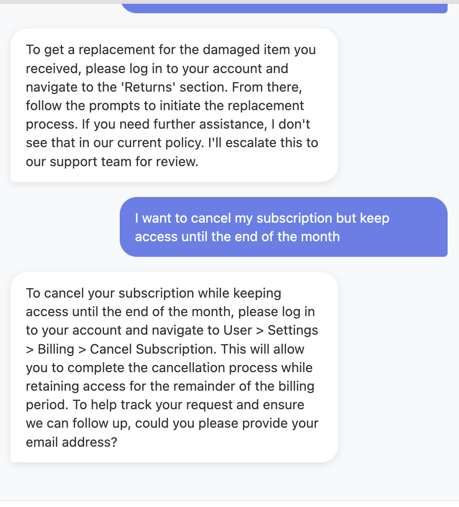
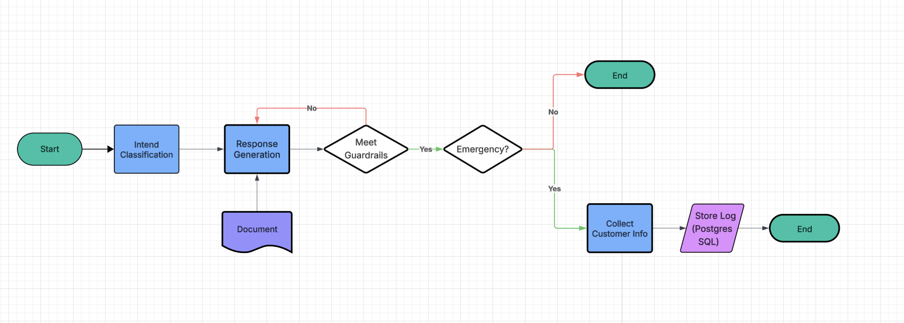

# Customer Support Agent

An AI-powered customer support agent that automatically handles customer inquiries with accurate, policy-based responses and intelligent escalation.

Try demo chatbot: [DEMO](https://customer-support-mvp.vercel.app/)

  
  

## Project Structure

```
customer-support-mvp/
├── src/              # Core application logic
│   ├── agent.py      # LangGraph workflow orchestration
│   ├── nodes.py      # Processing nodes (classification, RAG, etc.)
│   ├── state.py      # Conversation state schema
│   ├── prompts.py    # LLM prompt templates
│   ├── config.py     # Environment configuration
│   ├── supabase_client.py  # Database client
│   └── load_documents.py  # Load PDFs into vector DB
├── api/              # Vercel serverless function
│   └── index.py      # Production API entry point
├── app/              # Local development server
│   └── main.py       # FastAPI app for local dev
├── static/           # Frontend assets
│   ├── index.html    # Chatbot UI
│   └── *.png         # Images
└── tests/            # Test files
```

Read more technical details: [/src/README.md](./src/README.md).
## What It Does

The chatbot provides quick, accurate responses to customer questions about following categories:

- **Billing & Payment** - Charges, invoices, payment methods, pricing questions  
- **Subscription** - Starting, canceling, upgrading, or modifying subscriptions  
- **Account Issues** - Login problems, password resets, profile updates  
- **Shipping & Delivery** - Tracking information, delivery status, shipping updates  
- **Returns & Refunds** - Return processes, refund requests, damaged items  
- **General Inquiries** - Other customer service questions  

For more technical information (APIs, implementation details), see [/src/README.md](./src/README.md).

The chatbot extracts customer information (email, name, order IDs) from conversations, retrieves relevant policy information, generates responses that strictly adhere to company policies, and escalates complex or security-sensitive issues to human agents.


## Business Problem

Customer support teams face several challenges:

- **High Volume**: Large numbers of routine inquiries consume significant agent time
- **24/7 Demand**: Customers expect support availability outside business hours
- **Consistency**: Ensuring all agents provide accurate, policy-compliant responses
- **Resource Allocation**: Skilled agents spend time on repetitive questions instead of complex issues

## Solution

This AI agent addresses these challenges by:

1. **Instant Classification** - Automatically identifies the type of inquiry (billing, subscription, account, etc.)
2. **Policy-Based Responses** - Retrieves and uses exact company policy information to ensure accuracy
3. **Quality Validation** - Validates each response for accuracy and professionalism before sending
4. **Escalation** - Automatically escalates security emergencies, complex issues, or cases requiring human judgment
5. **Information Extraction** - Captures customer contact details and order information from natural conversation
6. **Conversation Memory** - Maintains context across multi-turn conversations for better assistance

## Business Results

Organizations using this agent experience:

- **Faster Response Times** - Customers receive instant answers instead of waiting in queues
- **Consistent Quality** - Every response adheres strictly to company policies, reducing errors
- **Reduced Costs** - Routine inquiries handled automatically, freeing agents for complex cases
- **24/7 Availability** - Customers get support anytime without additional staffing costs
