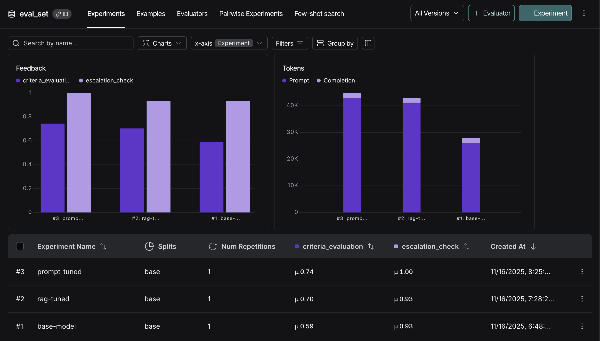
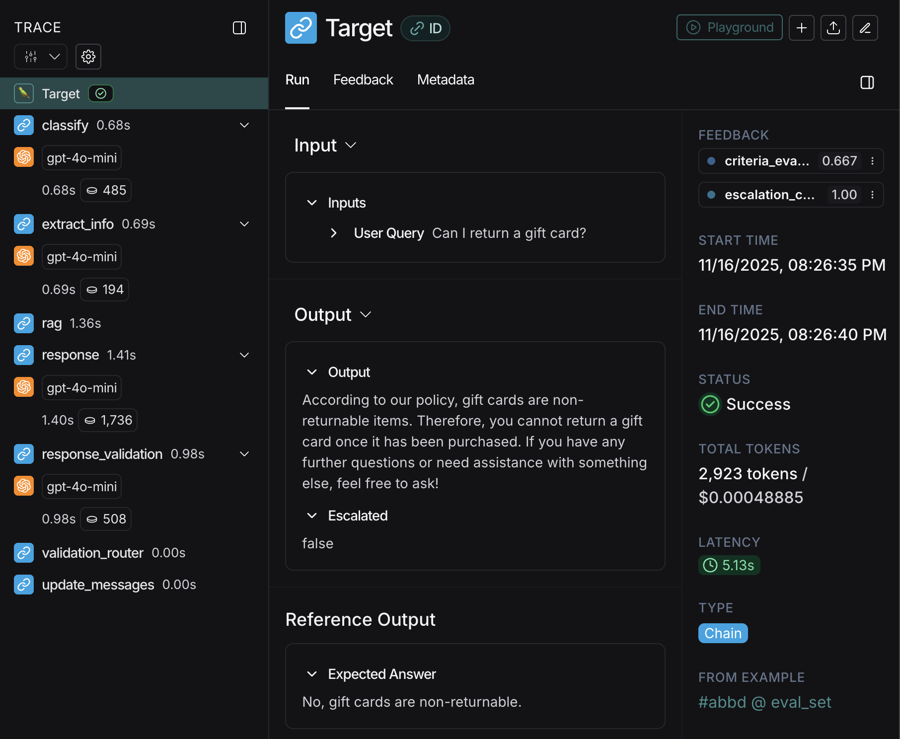

# Source Code Structure & Architecture

This document describes the internal structure, workflow, and configuration of the Customer Support Agent.

See the main project overview here: [README.md](../README.md).

## Project Structure

```text
src/
├── agent.py           # Main workflow orchestration using LangGraph
├── state.py           # Conversation state schema (Pydantic model)
├── nodes.py            # Individual processing nodes (classification, RAG, response generation, etc.)
├── prompts.py          # LLM prompt templates
├── config.py           # Environment configuration (LangSmith, API keys)
└── supabase_client.py  # Database client for escalation logging
```

## How It Works

### Workflow Architecture

The agent uses a **LangGraph StateGraph** with the following processing pipeline:


### Node Functions

#### 1. **classify** (`classify_intent`)

- **Purpose**: Categorizes user intent into one of: `billing`, `subscription`, `account`, `shipping`, `returns`, `general`

#### 2. **extract_info** (`extract_user_info`)

- **Purpose**: Extracts structured information from conversation (email, name, order_id, account_id)
- **Note**: Automatically updates Supabase escalation records if contact info is found later

#### 3. **rag** (`retrieve_context`)

- **Purpose**: Retrieves relevant policy documents using vector similarity search
- **Vector Store**: ChromaDB with OpenAI embeddings (`text-embedding-3-small`)
- **Retrieval**: Top 3 most similar chunks based on classification tag + user message
- **Output**: Sets `context` in state with retrieved policy text

#### 4. **response** (`generate_response`)

- **Purpose**: Generates customer service response based on policy context
- **Input**: Policy context, user message, conversation history (last 6 messages)
- **Logic**:
  - Asks for contact info if missing and issue type requires it (billing, subscription, account, returns)
  - Maintains conversation continuity
- **Output**: Sets `response` in state

#### 5. **response_validation** (`response_validation`)

- **Purpose**: Validates response quality and detects security emergencies
- **Validation Status**:
  - `PASS`: Response is acceptable
  - `RETRY`: Response needs regeneration (unfriendly/offensive)
  - `FAIL`: Security emergency detected or response would harm customer
- **Security Detection**: Automatically fails and escalates if user mentions:
  - Account hacked / security breach
  - Fraud / unauthorized charges
  - Identity theft / stolen account

#### 6. **update_messages** (`update_messages_node`)

- **Purpose**: Updates conversation history for checkpointing
- **Output**: Adds assistant response to `messages` list for persistence

#### 7. **escalate** (`escalation_node`)

- **Purpose**: Handles escalation to human support
- **Actions**:
  - Logs escalation data to Supabase
  - Generates escalation summary with full context
  - Prompts for email if contact info missing

## Evaluation & Performance

### Evaluation Framework

The chatbot is evaluated using **LangSmith** with an LLM-as-judge approach against ground truth test cases. Evaluation metrics focus on:

- **Policy Accuracy**: How precisely the response follows company policy (exact paths, timeframes, procedures)
- **Specificity**: How actionable and detailed the response is (specific steps, exact navigation paths)
- **Completeness**: Whether the response includes all necessary information to resolve the issue
- **Escalation Accuracy**: Whether escalation decisions are appropriate for the query type

### Performance History



#### Iteration 1: Base Model (Score: 0.59/1.0)

**Limitations**:

- Generic responses lacking specific details
- Fixed similarity threshold missed relevant documents
- No document filtering by query type

#### Iteration 2: RAG Optimization (Score: 0.70/1.0)

**Improvements**:

- Increased retrieval: `k=3` → `k=5` chunks for more comprehensive context
- Progressive threshold fallback: Tests multiple thresholds (0.5, 0.3, 0.2, 0.1) to find relevant documents
- Larger chunks: 1000 → 1500 characters with 200-character overlap for better context retention
- Document filtering: Prioritizes relevant policy documents based on classification tag

**Impact**: +19% improvement in response quality

#### Iteration 3: Prompt Engineering (Score: 0.74/1.0)

**Improvements**:

- Enhanced prompt instructions emphasizing exact timeframes, contact methods, and navigation paths
- Added strict rules against paraphrasing policy details
- Implemented security-aware escalation with immediate actionable steps
- Improved specificity requirements for all responses

**Impact**: +7% improvement, bringing total improvement to +25% over baseline

### Evaluation Dashboard


The LangSmith dashboard provides:

- Real-time evaluation metrics across test cases
- Detailed scoring breakdowns by criteria
- Individual test case analysis

### Detailed Evaluation Flow



Each evaluation run:

1. Executes the agent on standardized test cases
2. Captures full conversation state and retrieved context
3. Applies LLM-as-judge evaluation using GPT-4
4. Scores on multiple criteria (accuracy, specificity, completeness)
5. Aggregates results for overall performance metrics

## Current Settings

### Vector Store Configuration

- **Embedding Model**: `text-embedding-3-small` (OpenAI, 1536 dimensions)
- **Vector Database**: Supabase (pgvector)
- **Storage Location**: Supabase `document_embeddings` table
- **Chunking**:
  - Chunk size: 1500 characters (optimized for context retention)
  - Overlap: 200 characters (ensures continuity between chunks)
- **Retrieval Strategy**:
  - Top 5 similar chunks (`k=5`)
  - Progressive threshold fallback: 0.5 → 0.3 → 0.2 → 0.1
  - Document filtering by classification tag (with fallback to all documents)
- **Similarity Metric**: Cosine distance (1 - cosine similarity)

### Retry Logic

- **Max Retries**: 3 attempts for response generation
- **Retry Trigger**: Validation returns `RETRY` status
- **After Max Retries**: Automatically escalates to human support

### Contact Information Collection

The agent requests contact information when:

- No email/name is available
- Issue type is: `billing`, `subscription`, `account`, or `returns`
- At least 2 messages have been exchanged (after initial exchange)

### Policy Document Structure

Policy documents are stored as PDFs in `document/` directory:

- Account Management Policy.pdf
- Billing & Payment.pdf
- Contact Information.pdf
- Customer Support Policy.pdf
- Shipping & Delivery Policy.pdf
- Subscription Management Policy.pdf

Documents are loaded into Supabase vector database (pgvector) for semantic search.
